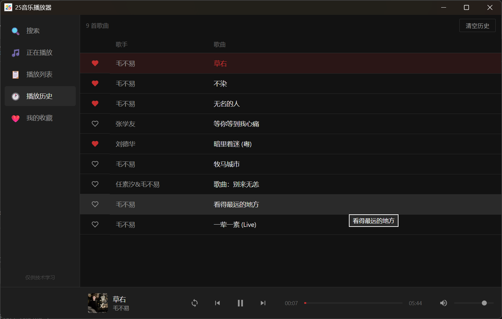
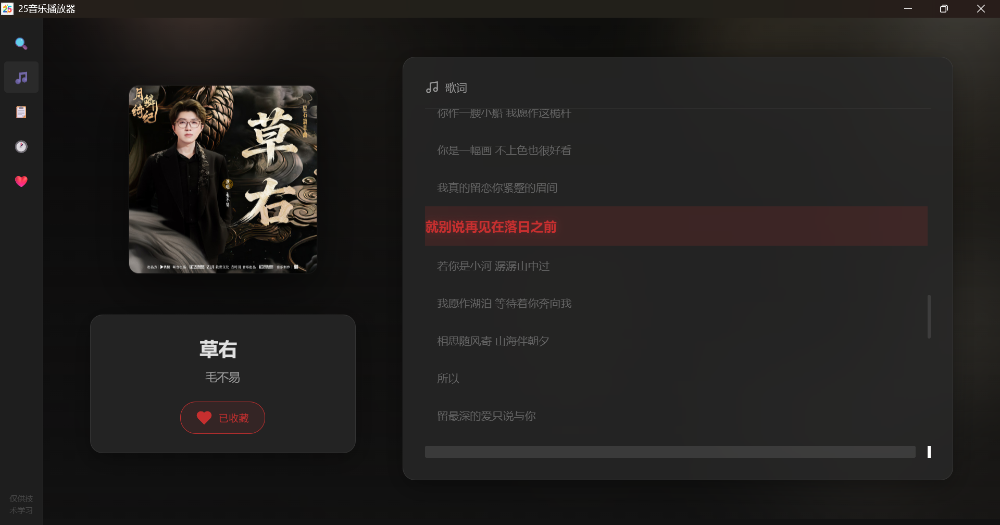

# 25音乐播放器

一个基于 Go + Wails 的轻量级桌面音乐播放器，集成第三方音乐源。

[](LICENSE)
[](https://golang.org/)
[](https://wails.io/)

## 📖 目录

- [✨ 特性](#-特性)
- [🚀 快速开始](#-快速开始)
- [🏗️ 架构说明](#️-架构说明)
- [📁 项目结构](#-项目结构)
- [🔧 配置说明](#-配置说明)
- [🎯 API 接口](#-api-接口)
- [🛠️ 构建与打包](#️-构建与打包)
- [❓ 常见问题](#-常见问题)
- [🤝 贡献指南](#-贡献指南)
- [📄 许可证](#-许可证)

---

## ✨ 特性

- 🚀 **轻量快速** - 原生编译，启动迅速
- 🎵 **在线搜索** - 支持搜索全网音乐库
- 🎶 **播放队列** - 智能管理个人播放列表
- 📝 **歌词显示** - 支持同步滚动歌词
- 🔄 **多种模式** - 顺序/随机/单曲循环
- 💾 **智能缓存** - 内存+文件双重缓存机制

## 📸 界面预览

### 播放历史



### 正在播放 & 歌词



*简洁现代的深色主题界面，支持播放历史、我的收藏、歌词同步滚动等功能*

## 🚀 快速开始

### 环境要求

- Go 1.25+
- Wails CLI（安装：`go install github.com/wailsapp/wails/v2/cmd/wails@latest`）
- Windows 10/11 (WebView2)

### 运行应用

```bash
# 方式1：使用启动脚本（推荐）
start_wails.bat

# 方式2：手动构建并运行
wails build
.\build\bin\music-player.exe
```

> ⚠️ **重要**：必须使用 `wails build` 命令构建桌面应用！

### 开发模式

```bash
# 方式1：纯 API 服务器（推荐用于日常开发）
# 优点：前端修改后刷新浏览器即可，调试方便
go run test_server.go
# 访问：http://127.0.0.1:8888

# 方式2：Wails 热重载模式（集成测试用）
# 优点：模拟真实桌面应用环境
wails dev
```

**开发建议**：日常开发使用 `test_server.go`（快速迭代），发布前使用 `wails dev/build` 验证完整性。

## 🏗️ 架构说明

### 数据存储策略

本项目采用**分层存储架构**，前后端各司其职：

#### 1. 前端 localStorage（UI状态层）
- **存储位置**: 浏览器/WebView的 localStorage
- **存储内容**: 
  - 播放列表（playlist）- 临时播放队列
  - 音量设置、播放模式等UI状态
  - 收藏和历史的本地缓存（用于快速显示）
- **特点**: 
  - ✅ 快速访问，无网络延迟
  - ✅ 每个用户独立存储
  - ⚠️ 仅作为缓存，权威数据在后端

#### 2. 后端文件系统（持久化数据层）
- **存储位置**: `~/.go-music-player/cache/`
- **存储内容**:
  - `favorites.json` - 收藏列表（权威数据源）
  - `history.json` - 播放历史（权威数据源）
  - `{hash}.json` - 搜索结果缓存（TTL: 1小时）
- **特点**:
  - ✅ 持久化到磁盘，重启不丢失
  - ✅ 搜索缓存可复用，提升性能
  - ✅ 桌面应用模式下天然用户隔离

### 数据同步机制

**应用启动时**：
1. 从 localStorage 加载 UI 状态（快速恢复界面）
2. 从后端 API 加载收藏和历史数据（权威数据源）
3. 同步到前端 State 和 localStorage（作为缓存）

**用户操作时**：
1. 先调用后端 API（确保数据持久化）
2. API 成功后更新前端 State
3. 保存到 localStorage（作为缓存）
4. 刷新相关页面显示

## 📁 项目结构

```
music-player/
├── internal/              # 内部包
│   ├── api/              # API 路由和处理器
│   ├── proxy/            # 代理服务层
│   ├── config/           # 配置管理
│   └── types/            # 数据类型
├── frontend/             # 前端资源
│   ├── css/             # 样式文件
│   ├── js/              # JavaScript 逻辑
│   └── index.html       # 主界面
├── main.go               # Wails 应用入口
├── app.go                # 应用逻辑
├── test_server.go        # 开发用测试服务器
└── wails.json            # Wails 配置
```

## 🔧 配置说明

配置文件位于 `internal/config/config.go`，可修改以下参数：
- **ServerPort**: 服务端口（默认 8888）
- **ServerHost**: 监听地址（默认 127.0.0.1）
- **MusicSource**: 音乐源地址
- **LyricsSource**: 歌词源地址

**修改端口示例**：
编辑 `internal/config/config.go`，修改 `ServerPort` 值后重新编译。

**端口冲突解决**：
如果遇到端口占用问题，可尝试更换为 8080、9000 等其他端口，或使用命令检查端口占用情况：
```powershell
netstat -ano | findstr :8888
```

## 🎯 API 接口

### 搜索歌曲
```
GET /api/search/:keyword
```

### 获取播放信息
```
POST /api/play
Body: id=xxx&type=music
```

### 获取歌词
```
GET /api/lrc/:lkid
```

### 健康检查
```
GET /api/test
```

## 🛠️ 构建与打包

### Wails 桌面应用构建

```bash
wails build
# 生成位置：build\bin\music-player.exe
```

### 跨平台编译

```bash
# Windows
GOOS=windows GOARCH=amd64 go build -o music-player.exe .

# macOS
GOOS=darwin GOARCH=amd64 go build -o music-player .

# Linux
GOOS=linux GOARCH=amd64 go build -o music-player .
```

## ❓ 常见问题

### 编译错误

```bash
# 清理缓存并重新下载依赖
go clean -cache
go mod tidy
```

### 运行问题

- 检查 WebView2 是否安装（Windows 10/11 默认已安装）
- 查看控制台输出日志
- 确认网络连接正常

### 搜索失败

- 检查音乐源网站是否可访问
- 查看代理设置
- 清除缓存后重试

### 数据存储位置

应用会在您的电脑上创建以下文件夹：
```
C:\Users\您的用户名\.25music-player\
├── cache\
│   ├── favorites.json      # 收藏的歌曲
│   ├── history.json        # 播放历史
│   └── [哈希值].json       # 搜索缓存（自动管理）
```

## 🤝 贡献指南

我们欢迎任何形式的贡献！在提交代码前，请阅读 [CONTRIBUTING.md](CONTRIBUTING.md)。

1. Fork 本仓库
2. 创建功能分支 (`git checkout -b feature/AmazingFeature`)
3. 提交更改 (`git commit -m 'feat: Add some AmazingFeature'`)
4. 推送到分支 (`git push origin feature/AmazingFeature`)
5. 开启 Pull Request

## 📄 许可证

本项目采用 MIT 许可证 - 详见 [LICENSE](LICENSE) 文件。

### 免责声明

1. 本软件仅用于学习和研究目的
2. 音乐资源来自第三方网站，版权归原作者所有
3. 请支持正版音乐，合理使用本软件
4. 使用本软件产生的一切后果由用户自行承担

### 特别鸣谢 🙏

本项目基于以下优秀的第三方服务构建：

- **音源搜索**：[22a5](https://www.22a5.com)
- **歌词服务**：[eev3](https://js.eev3.com)

感谢他们的资源支持，让本项目得以实现！

---

**享受音乐，享受生活！** 🎶

**Made with ❤️ using Go + Wails**
